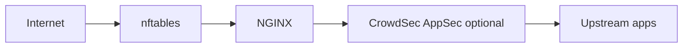

# Host firewall, CrowdSec, and NGINX (target architecture)

This document is the **implementation spec** for integrating **nftables** (host firewall), **CrowdSec Security Engine**, **CrowdSec firewall bouncer (nftables)**, **CrowdSec NGINX bouncer**, and existing **ModSecurity / NGINX** controls—**managed from Nginx Warden** with logging and reporting.

It assumes a single production host (or clearly documented multi-host later). **Do not lock out SSH (22), HTTP/HTTPS (80/443), or the control plane (API/UI ports)** during development or rollout.

---

## Design principles

1. **Nginx Warden owns the nftables ruleset** (tables, chains, ordering, allow/deny policy). Rules are **rendered from database state**, validated, and applied **atomically** with `nft -f` (or an equivalent single transaction). Avoid ad-hoc `nft add rule` in production paths.

2. **CrowdSec owns only the contents of dedicated ban sets** (IPs with timeouts). The **firewall bouncer** is configured in **set-only / managed-set** style so it does not fight the control plane for chain structure. See [CrowdSec firewall bouncer](https://docs.crowdsec.net/u/bouncers/firewall/).

3. **Layer separation** (CrowdSec’s own framing): **infrastructure (L3/L4)** vs **application (L7)**. Use the **firewall bouncer** for packet-level bans; use the **NGINX bouncer** for HTTP-aware remediation and optional **AppSec** forwarding. See [Remediation components overview](https://docs.crowdsec.net/u/bouncers/intro/).

4. **One primary HTTP inspection story at a time** to avoid overlapping duties: e.g. ModSecurity = primary WAF, CrowdSec AppSec = monitor-only initially—or the inverse—documented per vhost.

---

## Traffic flow (target)

- **nftables**: Drops unwanted sources **before** they hit userspace services; enforces trusted/deny/CrowdSec sets.
- **NGINX**: TLS, reverse proxy, `limit_req` / `limit_conn`, body sizes—**L7 rate and connection shaping stay here**, not in nftables. See [ngx_http_limit_req_module](https://nginx.org/en/docs/http/ngx_http_limit_req_module.html) and [limit_conn](https://nginx.org/en/docs/http/ngx_http_limit_conn_module.html).
- **ModSecurity**: Existing CRS/WAF path; keep a clear role vs CrowdSec AppSec.
- **CrowdSec**: Behavioral detection (engine) + remediation (bouncers). **Decisions are useless if no active bouncer applies them**—surface bouncer heartbeats in the UI. See [No active remediation component](https://docs.crowdsec.net/u/troubleshooting/issue_se_no_active_rc/).

---

## Required ports (do not break access)

These must remain reachable according to **your** policy (typically from **trusted** sources only where noted):

| Port | Role |
|------|------|
| **22** | SSH — allow only from **trusted** sets (or management VPN), never globally open unless explicitly intended |
| **80 / 443** | Public HTTP(S) as required by your sites |
| **3001** | Nginx Warden API (often restricted to trusted nets) |
| **8080** | Admin UI (Vite preview) — often restricted to trusted nets |
| **5432** | PostgreSQL — usually **localhost only** |
| **CrowdSec LAPI** | Default often `127.0.0.1:8080` for CrowdSec’s API—**do not confuse** with the Warden API port; document both |

**Rule-order caveat:** Evaluate **trusted** sources **before** CrowdSec blacklist drops unless product policy explicitly allows bans to override trust (usually **trusted wins** for admin paths).

---

## Core nftables rule flow (conceptual)

Order matters:

1. Accept **loopback**
2. Accept `ct state established,related`
3. Accept traffic from **trusted** sets (IPv4/IPv6)
4. Drop traffic from **CrowdSec** blacklist sets (timed bans)
5. Drop traffic from **local deny** sets
6. Allow **80/443** (and other **service** ports as defined by policy)
7. Allow **SSH** only from **trusted** (recommended)
8. Allow **management UI/API** only from **trusted** (recommended)
9. Drop or reject the rest

Use **stateful** filtering with conntrack—see [nftables: connection tracking](https://wiki.nftables.org/wiki-nftables/index.php/Matching_connection_tracking_stateful_metainformation).

---

## Managed sets (minimum)

| Set | Purpose |
|-----|--------|
| `trusted_ipv4` / `trusted_ipv6` | Admin, office, VPN—**never** ban accidentally |
| `local_deny_ipv4` / `local_deny_ipv6` | Static blocks from the UI |
| `crowdsec_blacklists` / `crowdsec6_blacklists` | **CrowdSec firewall bouncer only**—entries with **timeout** where supported |

CrowdSec’s firewall bouncer updates **sets**; your app **creates** the table/chains/rules that **reference** those sets. [Firewall bouncer (nftables)](https://docs.crowdsec.net/u/bouncers/firewall/).

---

## Phased implementation plan

### Phase 1 — nftables foundation

- Persistent table/chains owned by the app (naming convention, e.g. `inet nginx-warden-filter`).
- Stateful base: loopback, established/related, default drop/reject policy documented.
- **Atomic apply**: render full config → validate → `nft -f`.

### Phase 2 — Managed sets + policy objects

- Implement DB-backed models for sets, memberships, service policies, zones/bindings—not raw rule text as the only UX (see [Data model](#data-model) below).
- **Trusted** and **local deny** editable from UI; CrowdSec sets **not** hand-edited (read-only mirror + optional “flush” via API if safe).

### Phase 3 — CrowdSec Security Engine + firewall bouncer

- Install `crowdsec` + `crowdsec-firewall-bouncer-nftables` (or distro package names).
- Configure bouncer to target **only** CrowdSec-managed sets; LAPI URL + API key from `cscli bouncers add`.
- Acquisition for nginx/auth logs as appropriate; central logging is optional—see [Log centralization](https://docs.crowdsec.net/u/user_guides/log_centralization/).

### Phase 4 — CrowdSec NGINX bouncer

- Install and configure; start with **stream** mode (in-memory decisions + periodic sync) for latency. See [NGINX bouncer](https://docs.crowdsec.net/u/bouncers/nginx/).
- Enable **AppSec** forwarding only after baseline is stable. Reference: [WAF reverse proxy guide](https://docs.crowdsec.net/u/user_guides/waf_rp_howto/).

### Phase 5 — ModSecurity vs CrowdSec AppSec clarity

- Document per-vhost: which engine is **enforce** vs **detect**.
- Avoid four layers all “blocking” the same patterns without policy.

---

## Data model (target)

Suggested tables/entities (names indicative):

| Area | Entities |
|------|----------|
| Firewall | `firewall_tables`, `firewall_chains`, `firewall_sets`, `firewall_set_members`, `service_policies`, `source_groups`, `audit_events` |
| CrowdSec | `crowdsec_bouncers` (cached metadata), `crowdsec_decisions_cache`, sync/heartbeat timestamps |
| NGINX | `nginx_security_profiles` (limit_req zones, limit_conn, client body, bouncer mode flags) |

**Application behavior:** render nftables config from DB → validate → apply atomically; store last apply result, error text, and a **ruleset checksum** for drift detection.

---

## Management UI (what to build)

### Firewall policy layer

- Trusted sources, local deny lists, CrowdSec set **visibility** (not raw CrowdSec set mutation), service definitions, zone/bindings, port exposure policy, **temporary bans** with expiry, **audit** of changes.

### CrowdSec integration layer

- Engine health, **registered bouncers** + last heartbeat, decision counts, active bans (source/scenario), **whitelist** status, sync errors.

### NGINX security layer

- Per-vhost: CrowdSec bouncer on/off, **bouncer mode** (e.g. stream vs live if supported), AppSec forward toggle, ModSecurity mode, **`limit_req` / `limit_conn`**, client body/size limits—aligned with [limit_req](https://nginx.org/en/docs/http/ngx_http_limit_req_module.html).

---

## Observability

Expose in API/UI where practical:

- Last nftables apply result + timestamp + **checksum**
- CrowdSec bouncer **heartbeat** / last pull ([inactive bouncers](https://docs.crowdsec.net/u/troubleshooting/issue_se_no_active_rc/))
- Active decisions by scenario; top blocked IPs (from CrowdSec + local)
- NGINX bouncer mode; optional **nft** counter/logging hooks ([nftables logging](https://wiki.nftables.org/wiki-nftables/index.php/Logging_traffic))

---

## Whitelisting (two layers)

1. **nftables trusted sets** — never route admin traffic through accidental bans.
2. **CrowdSec whitelists** — parsers / AllowLists / postoverflow as needed so noisy but legitimate traffic does not create decisions. See [Whitelists](https://docs.crowdsec.net/u/getting_started/post_installation/whitelists/).

**Note:** Whitelisting in CrowdSec does not remove **existing** decisions—may need `cscli decisions delete` for stale bans.

---

## Reference links

| Topic | URL |
|-------|-----|
| Remediation components (choose firewall vs NGINX) | [docs.crowdsec.net — Bouncers intro](https://docs.crowdsec.net/u/bouncers/intro/) |
| Firewall bouncer (nftables) | [docs.crowdsec.net — Firewall](https://docs.crowdsec.net/u/bouncers/firewall/) |
| NGINX bouncer (stream, AppSec) | [docs.crowdsec.net — NGINX](https://docs.crowdsec.net/u/bouncers/nginx/) |
| WAF / reverse proxy patterns | [docs.crowdsec.net — WAF RP howto](https://docs.crowdsec.net/u/user_guides/waf_rp_howto/) |
| Log centralization (optional multi-host) | [docs.crowdsec.net — Log centralization](https://docs.crowdsec.net/u/user_guides/log_centralization/) |
| nftables wiki (sets, state, logging) | [wiki.nftables.org](https://wiki.nftables.org/wiki-nftables/index.php/Main_Page) |
| NGINX `limit_req` | [nginx.org — limit_req](https://nginx.org/en/docs/http/ngx_http_limit_req_module.html) |

---

## Safety checklist for implementers

- [ ] Never apply nftables changes without **validation** and a defined **rollback** path (e.g. saved known-good file, timer-based auto-revert, or out-of-band access).
- [ ] **SSH 22** and management CIDRs in **trusted** before enabling default drop.
- [ ] Distinguish **CrowdSec LAPI** port from **Nginx Warden API** port in docs and config.
- [ ] Confirm **both** bouncers registered and heartbeating before claiming “protected”.
- [ ] Integration tests in staging with real `nft` and CrowdSec packages—not only mocks.

This spec is **forward-looking**; not all phases may be implemented yet. Track progress in the project issue tracker.

### Implemented in product (Phase 1 + diagnostics)

- **Fleet → Firewall** (`/firewall`, admin): edit `FirewallSettings` and **address lists** (trusted / local deny, IPv4 and IPv6), **preview** generated nftables text, **apply** via `nft -f` on Linux (or `NFT_APPLY_DISABLED` / non-Linux for safe testing).
- **API:** `GET/PUT /firewall/...` — see `apps/api/src/domains/firewall/`.
- **Diagnostics:** `GET /firewall/crowdsec-status` runs `cscli` on the API host (version, bouncers list, metrics) and optionally probes CrowdSec LAPI when `CROWDSEC_API_KEY` is set. `GET /firewall/nft-runtime` runs `nft list table inet nginx_warden_filter`. Same data is shown under **Diagnostics** on the Firewall page (30s refresh).
- **Host install helpers:** `scripts/install-crowdsec.sh` and `scripts/templates/crowdsec-firewall-bouncer.yaml` (merge with the bouncer package’s real config; **set-only** + table `nginx_warden_filter` + set names from the UI). **`scripts/apply-crowdsec-firewall-bouncer-template.sh`** installs the template to `/etc/crowdsec/bouncers/` with backup and optional `CROWDSEC_BOUNCER_API_KEY`. Optional: `scripts/install-crowdsec-nginx-bouncer.sh` for the Lua/nginx bouncer (requires Lua-capable nginx). **`scripts/templates/crowdsec-appsec-nginx.include.example`** is a no-op placeholder for `CROWDSEC_APPSEC_INCLUDE` until you add real AppSec rules.
- **Per-domain (Fleet → Domains → edit):** `limit_req` / `limit_conn` (requests/min, burst, concurrent conns per client IP), ModSecurity engine mode (**On** vs **Detection only**), CrowdSec L7 (Lua `access_by_lua` when `ENABLE_CROWDSEC_NGINX_LUA=true` on the API), CrowdSec AppSec (`include` from `CROWDSEC_APPSEC_INCLUDE` when set). Stored on `domains` in Postgres; vhost generation is in `nginx-config.service.ts`.
- **Firewall diagnostics:** `GET /firewall/crowdsec-decisions` returns a sample of LAPI decisions when `CROWDSEC_API_KEY` is set; **Load from LAPI** on the Firewall page.
- **Not implemented:** Persistent CrowdSec bouncer/decision cache in DB, automated acquisition setup, full per-vhost AppSec rule authoring in UI (operators still install connector snippets on the host).
